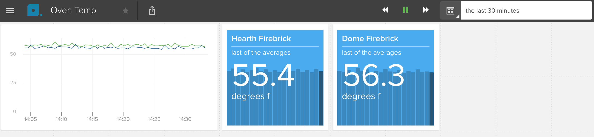

# temp-logger

Configurable temperature logger based on MAX31855 for Raspberry Pi.  Sends data to [Librato](https://librato.com) which provides nice charts and graphs.



### Instructions:

- Create a YAML file on your pi at /etc/temp-logger.yml like:
```
logfile: /var/log/temp-logger.log
frequency: 30
clock_pin: 21
data_pin: 20
thermocouples:
  - name: t1
    pin: 18
  - name: t2
    pin: 17
librato_key: YOUR_LIBRATO_KEY_HERE
librato_email: YOUR_LIBRATO_EMAIL_HERE
```

- Execute the following:
```
git clone https://github.com/dlleigh/temp-logger.git
cd temp-logger
make deploy
python temp_logger.py &
```

- Logs will be available in /var/log/temp-logger.log.  It's a good idea to add a file `/etc/logrotate.d/temp-logger` with:
```
compress
/var/log/temp-logger.log {
	rotate 5
	daily
}
```

### Acknowledgements:

Thanks to @Tuckie for providing the [Python library for the MAX31855](https://github.com/Tuckie/max31855)
